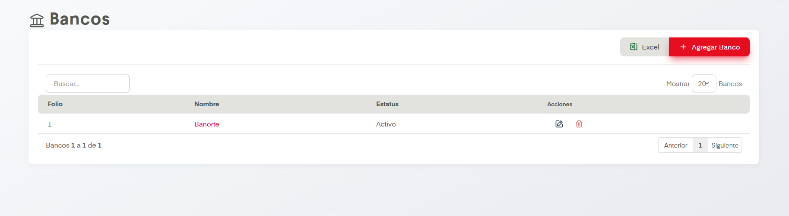

# Bancos

??? info "Sobre la enumeración de acciones"

    Esta página no tiene mucho contenido así que se omitirá la enumarción de acciones.

En el apartado de Bancos se nos permite dar de alta, editar y eliminar Bancos en SIP.

## Acciones Importantes

Como en otras pantallas, se cuenta con un cuadro de busqueda, botón de exportación a archivo compatible con Excel y un controlador para ver las páginas de registros en caso de que haya más de una página.

La acción principal en esta pantalla es Agregar Banco. Esta nos desplegará un formulario donde se solicita el nombre del banco a agregar y su estatus (Activo / Inactivo). Posterior a agregarlo aparecerá en la tabla. Si se desean hacer ediciones podemos dar click en el nombre del banco o en el ícono del lápiz, ambos llevan a la misma pantalla de edición. Así mismo es posible eliminar bancos si damos click en el ícono del bote de basura.