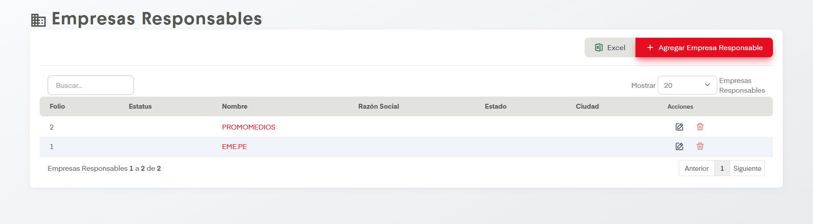
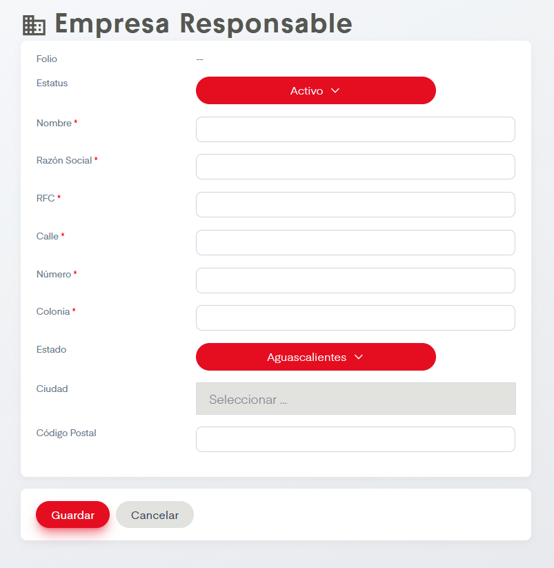

# Tipos de Vistas

??? info "Sobre la enumeración de acciones"

    Esta página no tiene mucho contenido así que se omitirá la enumarción de acciones.

En el apartado de Empresas se nos permite dar de alta, editar y eliminar Empresas en SIP.

## Acciones Importantes

Como en otras pantallas, se cuenta con botón de exportación a archivo compatible con Excel y un controlador para ver las páginas de registros en caso de que haya más de una página. También contamos con un cuadro de busqueda. Si se desean hacer ediciones podemos dar click en el nombre de los tipos de vista o en el ícono del lápiz, ambos llevan a la misma pantalla de edición. Es posible  también eliminar las empresas si damos click en el ícono del bote de basura.

La acción principal en esta pantalla es Agregar Empresa Responsable. Este botón dirige a la siguiente pantalla.

Se deben llenar los datos para dar de alta la empresa. Los datos que aparecen con asterisco a la izquierda son campos obligatorios. Cuando deseemos editar alguna empresa se dirigirá al usuario a esta misma pantalla.