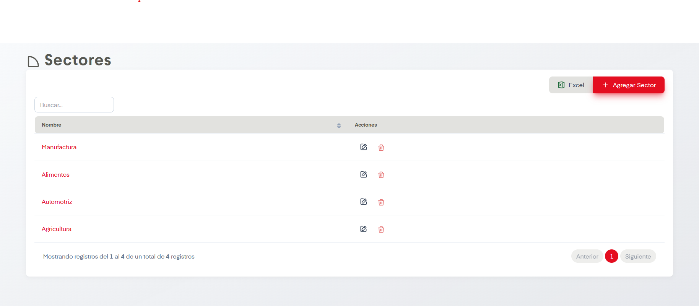

# Sectores

??? info "Sobre la enumeración de acciones"

    Esta página no tiene mucho contenido así que se omitirá la enumarción de acciones.

En el apartado de Sectores se nos permite dar de alta, editar y eliminar sectores en SIP.

## Acciones Importantes

Como en otras pantallas, se cuenta con botón de exportación a archivo compatible con Excel y un cntrolador para ver las páginas de registros en caso de que haya más de una página.

La acción principal en esta pantalla es Agregar Sector. Esta nos desplegará un formulario donde únicamente se solicita el nombre del sector a agregar. Posterior a agregarlo aparecerá en la tabla. Si se desean hacer ediciones podemos dar click en el nombre de la sector o en el ícono del lápiz, ambos llevan a la misma pantalla de edición. Así mismo es posible eliminar el sector si damos click en el ícono del bote de basura.