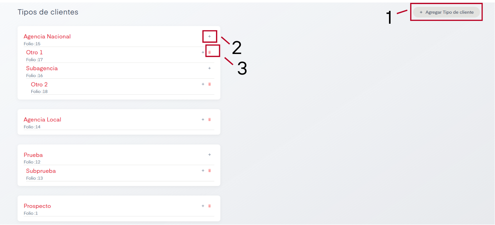

# Tipos de Clientes

En el apartado de Tipos de Clientes se nos permite dar de alta y eliminar tipos de clientes en SIP.

## Acciones Importantes

Como se puede observer, la pantalla de Tipos de Clientes es distinta de las demás pantallas de la sección de catálogos, sin embargo su uso es sencillo. A continuación se explica cada acción disponible.

### 1. Agregar Tipos de Clientes

Este botón nos permite agregar un cliente padre, lo llamaremos así ya que de este cliente pueden salir subtipos. Al momento de crearlo únicamente se nos solicitará nombre para el tipo de cliente.

### 2. Agregar Subtipo

Este botón aparece junto con el nombre del cliente padre, también al crearlo se nos pedirá un nombre solamente para el subtipo. Del subtipo creado también es posible crear más subtipos.

### 3. Eliminar subtipo

Nos permite eliminar tipos y subtipos de clientes. Se debe tener en cuenta que la eliminación siempre empezará por el elemento más reciente, es decir, debemos eliminar primero los subtipos para poder eliminar a sus clientes padre.