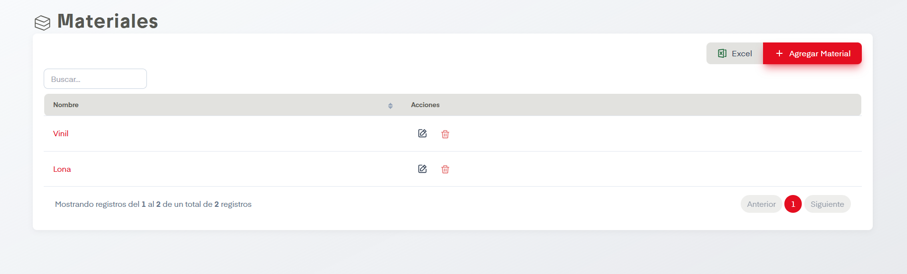

# Tipos de Materiales

??? info "Sobre la enumeración de acciones"

    Esta página no tiene mucho contenido así que se omitirá la enumarción de acciones.

En el apartado de Tipos de Materiales se nos permite dar de alta, editar y eliminar tipos de sitios en SIP.

## Acciones Importantes

Como en otras pantallas, se cuenta con botón de exportación a archivo compatible con Excel y un controlador para ver las páginas de registros en caso de que haya más de una página.

La acción principal en esta pantalla es Agregar Material. Esta nos desplegará un formulario donde únicamente se solicita el nombre de los tipos de materiales a agregar. Posterior a agregarlo aparecerá en la tabla. Si se desean hacer ediciones podemos dar click en el nombre de los tipos de materiales o en el ícono del lápiz, ambos llevan a la misma pantalla de edición. Así mismo es posible eliminar los tipos de materiales si damos click en el ícono del bote de basura.