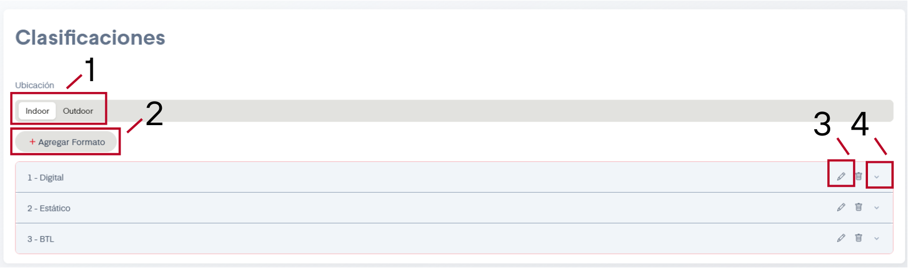
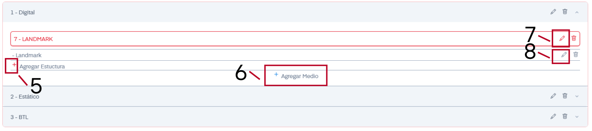

# Clasificación de sitios

En el apartado de Clasificaciones se nos permite dar de alta, editar y eliminar formatos Indoor y Outdoor.

Solo contaremos con el botón de Guardar si estamos de acuerdo con los cambios realizados o de cancelar si queremos regresar a los datos anteriormente establecidos y salir de la sección.

