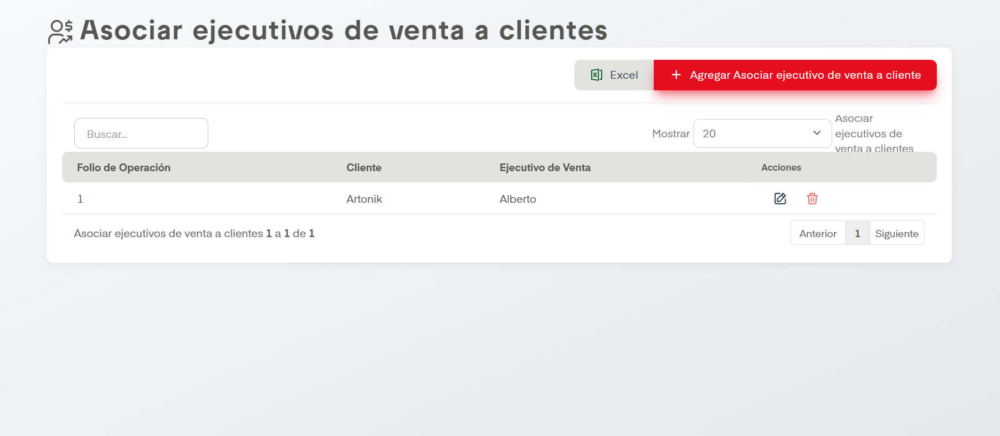

# Asociar Cliente a Vendedor

??? info "Sobre la enumeración de acciones"

    Esta página no tiene mucho contenido así que se omitirá la enumarción de acciones.

En el apartado de Asociar ejecutivos de venta a clientes se nos permite dar de alta, editar y eliminar estas asociaciones en SIP.

## Acciones Importantes

Como en otras pantallas, se cuenta con un cuadro de busqueda, botón de exportación a archivo compatible con Excel y un controlador para ver las páginas de registros en caso de que haya más de una página. También contamos con los botones comunes de edición y baja.

La acción principal en esta pantalla es Agregar Asociar ejecutivo de venta a cliente. Esta nos desplegará un formulario donde simplemente hay que agregar el cliente y el vendedor que se desea asociar.
