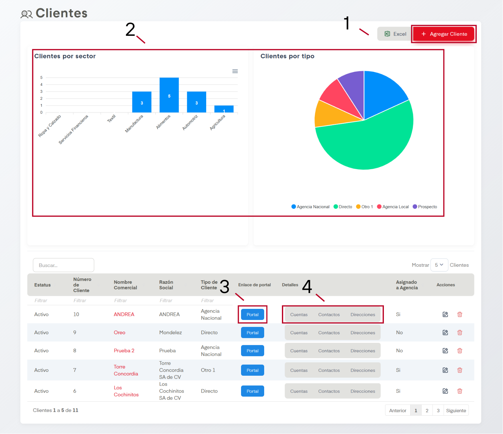
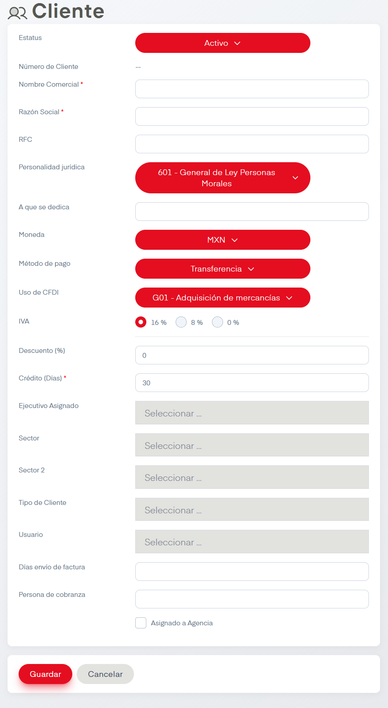
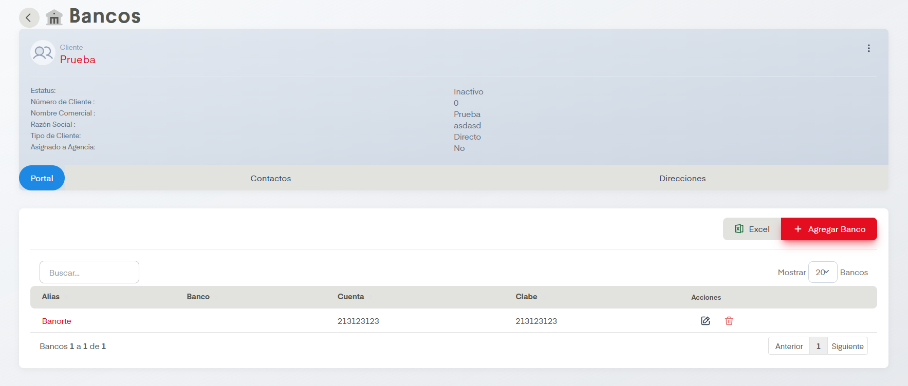
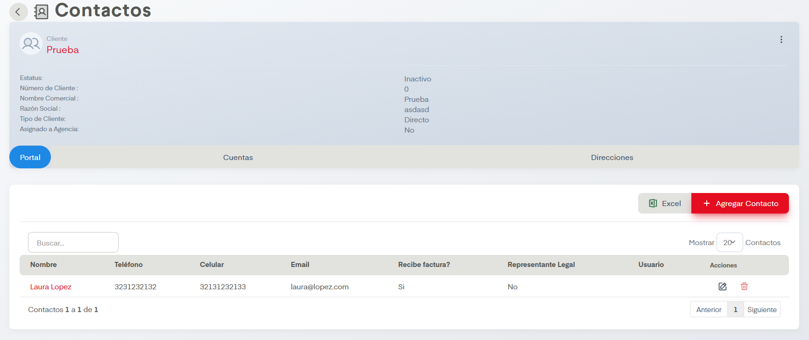
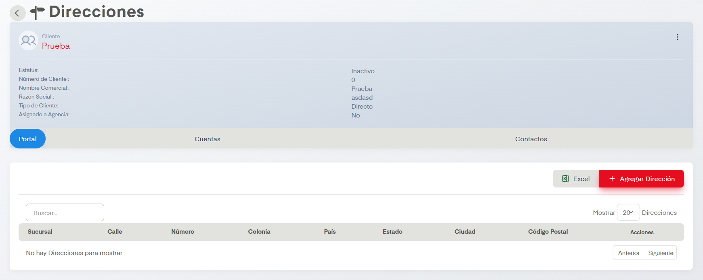

# Clientes

En el apartado de Clientes se nos permite visualizar en gráficas los clientes según tipo y sector, además de dar de alta, editar y eliminar clientes en SIP.

## Acciones Importantes

Como en otras pantallas, se cuenta con botón de exportación a archivo compatible con Excel y un controlador para ver las páginas de registros en caso de que haya más de una página. También contamos con un cuadro de busqueda. Si se desean hacer ediciones podemos dar click en el nombre comercial o en el ícono del lápiz, ambos llevan a la misma pantalla de edición. Es posible  también eliminar clientes si damos click en el ícono del bote de basura.

### 1. Agregar Cliente

La acción principal en esta pantalla es Agregar Cliente. Este botón dirige a la siguiente pantalla.

Se deben llenar los datos para dar de alta al cliene. Los datos que aparecen con asterisco al final son campos obligatorios.

### 2. Visualizador de Clientes

Aquí se muestran los clientes por sector y tipo en barras y gráfica respectivamente. Es posible descargar en CSV, PNG y en SVG la tabla de Clientes por Sector por medio de las tres líneas que aparecen justo encima de la tabla.

### 3. Enlace de Portal

Seleccionar este botón nos dirigirá al <a href="/portales/cliente/">Portal de Clientes</a>.

### 4. Detalles

Nos dan 3 botones para consultar, agregar, editar o dar de baja los detalles de cada cliente, estos detalles son son:

#### Cuentas

Desde esta pantalla de cuentas podemos consultar, agregar, editar o dar de baja cuentas relacionadas al cliente seleccionado. En el botón de agregar nos desplegará un formulario que solicitará alias, banco, cuenta y clabe interbancaria para la alta de la cuenta. Es posible pasar a los otros detalles por medio de los botones a la derecha del botón azul que dice Portal.

#### Contactos

Desde esta pantalla de cuentas podemos consultar, agregar, editar o dar de baja contactos relacionadas al cliente seleccionado. En el botón de Agregar Contacto nos desplegará un formulario que solicitará sucursal, nombre, teléfono, celular, email (aquí marcamos si este recibe factura o si es representante legal) y usuario para la alta del contacto.

Es posible pasar a los otros detalles por medio de los botones a la derecha del botón azul que dice Portal.

#### Direcciones

Desde esta pantalla de cuentas podemos consultar, agregar, editar o dar de baja direcciones relacionadas al cliente seleccionado. En el botón de Agregar Dirección nos desplegará un formulario que solicitará sucursal, calle, número, colonia, país, estado, ciudad y código postal para el alta de la dirección.

Es posible pasar a los otros detalles por medio de los botones a la derecha del botón azul que dice Portal.