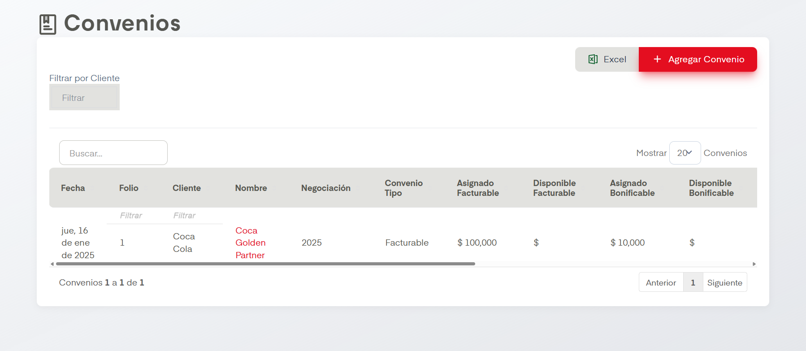
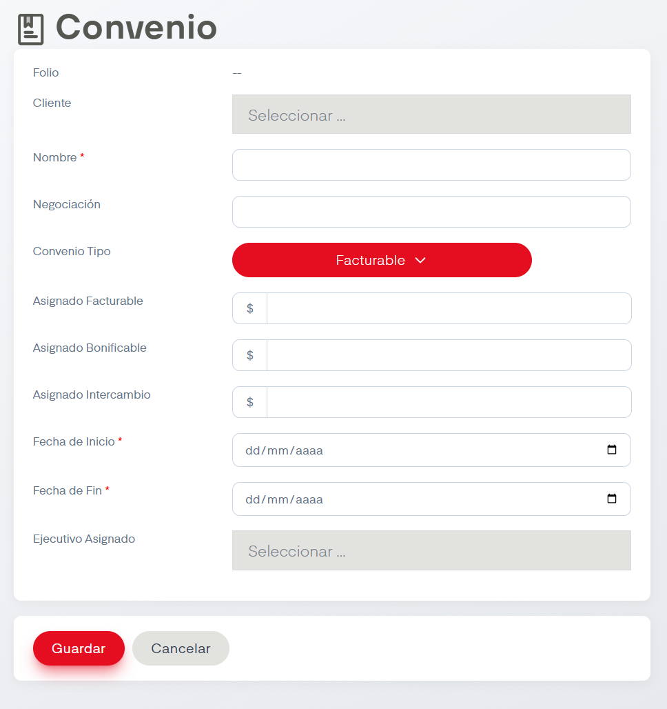

# Convenios

??? info "Sobre la enumeración de acciones"

    Esta página no tiene mucho contenido así que se omitirá la enumarción de acciones.

En el apartado de Convenios se nos permite dar de alta, editar y eliminar convenios en SIP.

## Acciones Importantes

Como en otras pantallas, se cuenta con un cuadro de busqueda, botón de exportación a archivo compatible con Excel y un controlador para ver las páginas de registros en caso de que haya más de una página.

La acción principal en esta pantalla es Agregar Convenio. Esta nos desplegará el siguiente formulario, es importante recordar que lo marcado con asteriscos son campos obligatorios.

