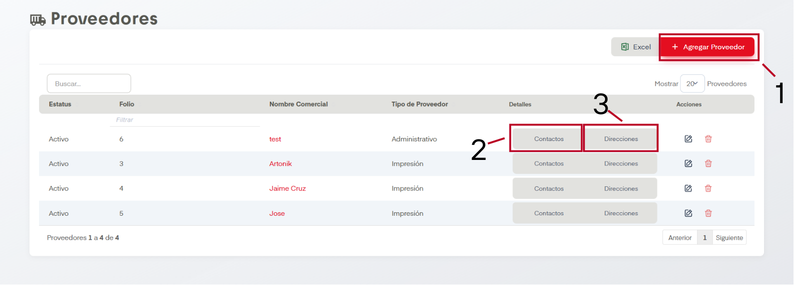
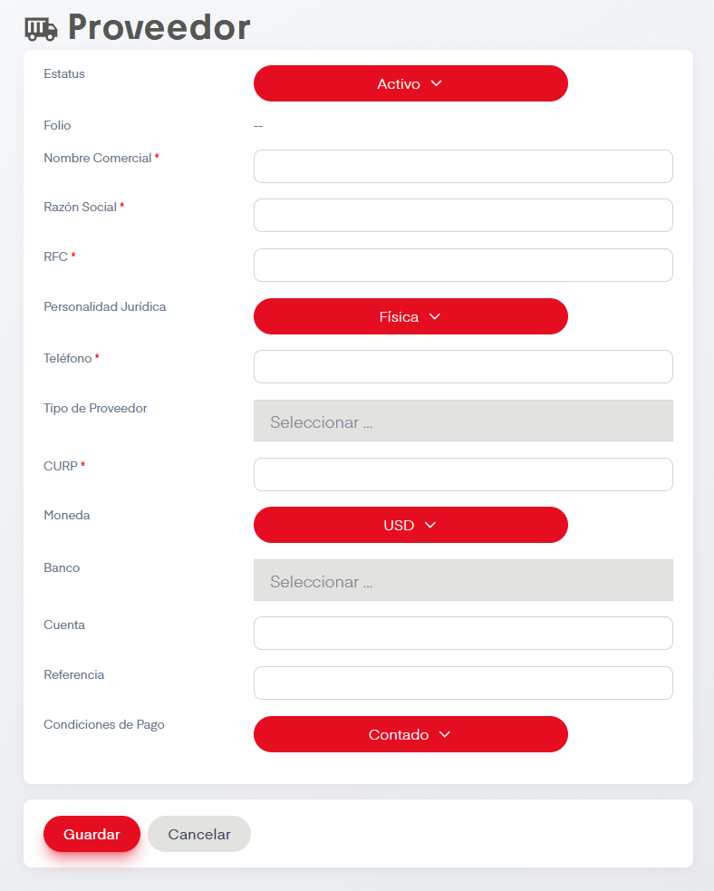
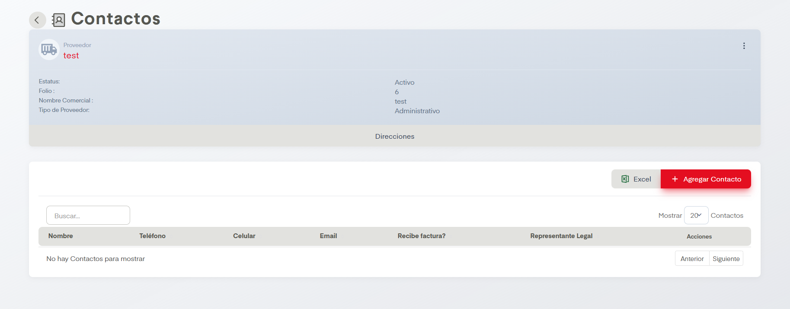
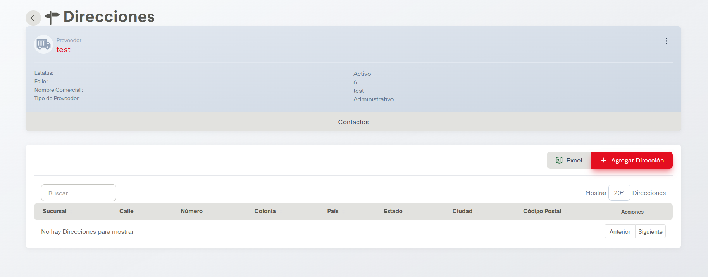

# Proveedores

En el apartado de Agencias se nos permite dar de alta, editar y eliminar agencias en SIP.

## Acciones Importantes

Como en otras pantallas, se cuenta con botón de exportación a archivo compatible con Excel y un controlador para ver las páginas de registros en caso de que haya más de una página. También contamos con un cuadro de busqueda. Si se desean hacer ediciones podemos dar click en el nombre de la agencia o en el ícono del lápiz, ambos llevan a la misma pantalla de edición. Es posible  también eliminar agencias si damos click en el ícono del bote de basura.

### 1. Agregar Agencia

La acción principal en esta pantalla es Agregar Agencia. Este botón dirige a la siguiente pantalla.

Se deben llenar los datos para dar de alta la agencia. Los datos que aparecen con asterisco a la izquierda son campos obligatorios. Cuando deseemos editar alguna agencia se dirigirá al usuario a esta misma pantalla.

### 2. Contactos

En esta sección nos aparecen los contactos pertenecientes a la agencia y su celular, mail, usuario asociado y también controladores de páginas y los mismos botones de acciones para editar y eliminar e incluso un botón para exportar los contactos a un documento compatible con excel. Tenemos también el botón de Agregar Contacto que muestra un formulario donde se solicita sucursal, nombre, teléfono, celular, mail casillas de verificación a marcar para saber si recibe factura o es representante legal y por último usuario, posteriormente es posible guardar el contacto.

### 3. Direcciones

En esta sección nos aparecen las direcciones asociadas a la agencia. Se muestra calle, número, colonia, país, estado, ciudad y código postal, también hay controladores de páginas y los mismos botones de acciones para editar y eliminar e incluso un botón para exportar las direcciones a un documento compatible con excel. Tenemos también el botón de Agregar Dirección que muestra un formulario donde se solicita sucursal, calle, número, colonia, país, estado, ciudad y código postal.Posteriormente es posible guardar la dirección.

