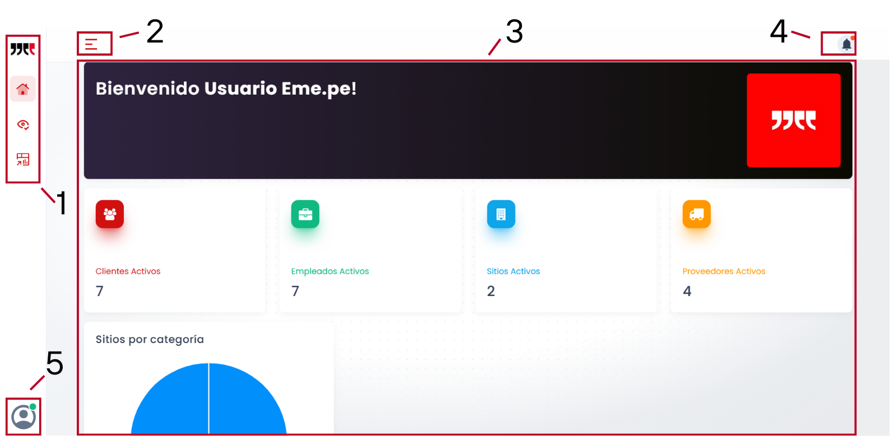

# Introducción

Lorem ipsum dolor sit amet, consectetur adipiscing elit. Donec eget gravida est. Praesent ut lectus mauris. Etiam faucibus odio quam, quis dapibus dolor faucibus et. Nulla pellentesque ipsum vel ipsum pretium bibendum. Vestibulum sapien ante, accumsan et scelerisque a, mollis in nisl. Nam tempus sem venenatis turpis blandit porta. Proin.

## Dashboard principal

Esta es la primera pantalla que veremos al acceder a la aplicación web SIP. Desde esta pantalla podremos viajar a cada una de las opciones que la aplicación nos ofrece.

A continuación mostraremos una captura de esta pantalla con sus distintas secciones enumeradas, posteriormente se explicará qué uso tiene cada una de estas.

### Secciones

1. Barra Lateral: En esta primera barra lateral tendremos la opción de viajar a tres portales principales:

    - <a href="{{ base_url }}/oferta/sitios/">Inicio</a> : Aquí veremos una pantalla de bienvenida para el usuario (nosotros) y también un resumen con la cantidad de clientes, empleados, sitios y proveedores activos. También se despliega una grafica de pastel con los sitios por categoría.

    - <a href="/portales/testigos/">Testigos</a> : En esta sección se ven las Tomas de Testigos, tendremos opción de Aprobar o rechazar las tomas, de ser aprobadas desaparecerán de este dashboard. En cambio si rechazamos la toma, habrá que agregar la razón por la que se rechaza la toma. A diferencia de las tomas aprobadas, las tomas rechazadas aparecerán en el fondo de la página.

    - <a href="/portales/cliente/">Cliente</a> : Se despliega un resumen con la información relevante respecto a clientes. Visualizaciones totales, incremento mensual, vistas contratadas, promedio de visualizaciones, vistas por renovar y pendientes. Aparece también una gráfica de barras que compara el año anterior con el presente.

2. Selector de dashboards: Fuera del dashboard de Inicio del cual ya hablamos previamente, existen diferentes Dashboards que está divididos por categorías. Estas categorías son:

    - <a href="/oferta/sitios/">Oferta</a> 

    - <a href="/ventas/analisis/">Ventas</a>

    - <a href="/contactos/clientes/">Contactos</a>

    - <a href="/operaciones/empleados/">Personal</a>

    - <a href="/catalogos/sectores/">Catalogos</a>

    - <a href="/clasificacion/plataformas/">Clasificación</a>

    - <a href="/sistema/config/">Sistema</a>

3. Pantalla principal: Como ya se explico durante el punto 1, esta no es más que una bienvenida y también un resumen con la cantidad de clientes, empleados, sitios y proveedores activos, así mismo cuenta con una grafica de pastel con los sitios por categoría.

4. Notificaciones: Cualquier acción realizada sobre cotizaciones se verán reflejadas aquí.

5. Perfil: Muestra una pantalla con los datos del usuario (Nomrbe de Usuario y Correo) además de un botón para cerrar la sesión.

                        
