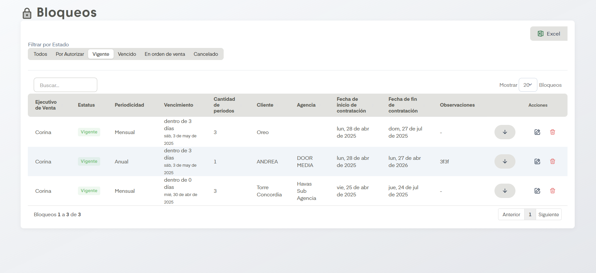

# Bloqueos

Si a un sitio le fue solicitado su bloqueo, está o estuvo bloqueado, aparecerá en esta sección.

??? info "Sobre la enumeración de acciones"

    Esta página no tiene mucho contenido así que se omitirá la enumarción de acciones.

## Acciones Importantes

Contamos con controladores comunes como la opción de exportar a excel, cuadro de busqueda y navegación entre páginas de tablas, así como acciones de editar (representada con un lápiz) y eliminar (representada con un bote de basura).

Empecemos por la opción de Filtrar por Estado, está opción nos dejará rotar entre tablas de Bloqueos en función de su estado (Por Autorizar, Vigente, Vencido, En orden de venta y Cancelado) o si así se desea se pueden desplegar todos los bloqueos sin importar su estado.

Posteriormente, en cada Bloqueo aparecerá una flecha donde se pueden realizar distintas acciones dependiendo del estado del bloqueo.

- Por Autorizar: En este tipo de bloqueo las opciones que tenemos son Autorizar, Extender Vigencia y Rechazar.

    No pide ningún proceso adicional ninguna de estas acciones, Autorizar pasa el bloqueo a estatus Vigente, Rechazar los manda a cancelado y extender va a programar el vencimiento de un bloqueo a 6 días adelante siempre que tenga menos de los mismos 6 días.

- Vigente: Extender Vigencia, Crear Cotización, Crear Orden de Venta, Cancelar Bloqueo.

    Extender Vigencia actúa de la misma forma que en el estatus Por autorizar, Cancelar Bloqueo manda a Cancelado. Las dos nuevas opciones son Crear Cotización y Crear Orden de Venta.

    Crear Cotización: Despliega el mismo formulario que al crear una cotización a través de los <a href="../disponibilidad/#4-Cuadros-de-Seleccion">cuadros de selección en Disponibilidad</a>, solo que esta vez lo hacemos desde un bloqueo y no desde un sitio disponible.

    Crear Orden de Venta: Al hacer cclick redirigirá al usuario a la siguiente pantalla

- Vencido: Sin acciones listadas.

- En orden de Venta: 

- Cancelado: 

??? info "Sobre agregar bloqueos"

    Únicamente es posible agregar bloqueos a través de los <a href="../disponibilidad/#4-Cuadros-de-Seleccion">cuadros de selección en Disponibilidad</a>.

