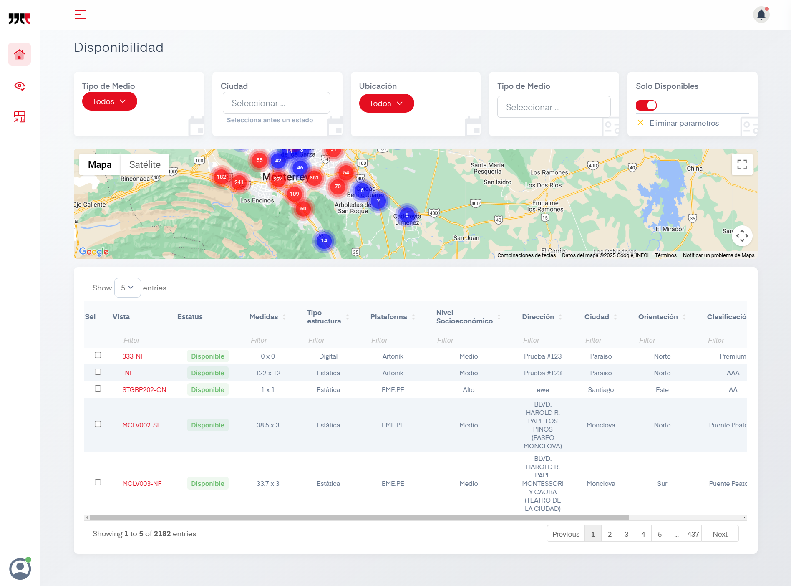
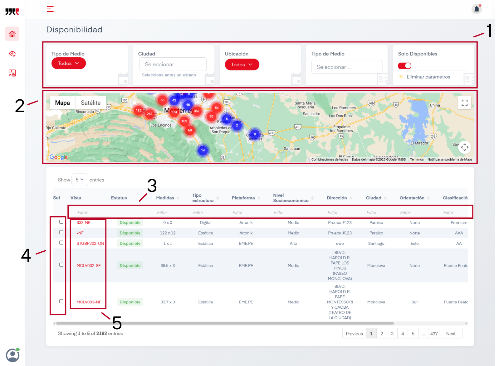
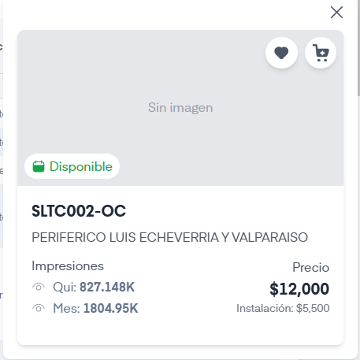
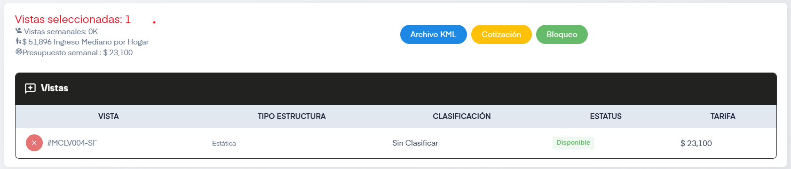
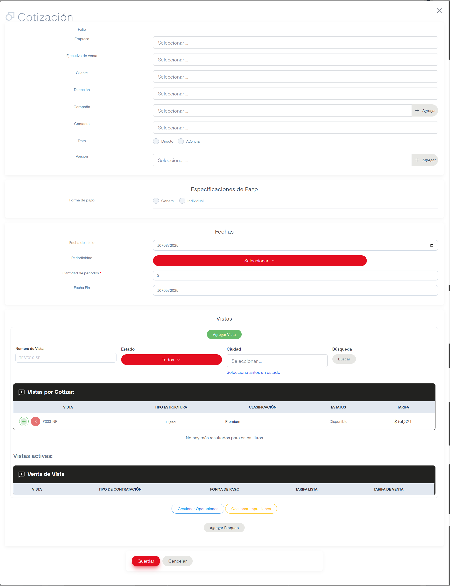
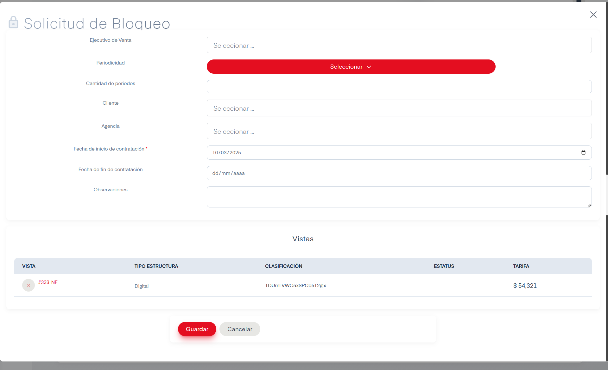

# Disponibilidad

## Introducción

Segundo deashboard de la categoría Oferta. Se muestra una tabla con todos los sitios cargados al sistema. La pantalla ofrece un mapa con los distintos sitios cargados al sistema, encima de este mapa hay filtros que podemos aplciarle. y debajo una tabla con los sitios según los filtros aplicados. 

!!! tip

    Con el cursor sobre la tabla,  `SHIFT + Rueda del Ratón` para navegar a través de ella.

## Acciones Importantes

A continiación se enumeran opciones de la sección de Sitios:

### 1. Filtros Generales
Existen 5 filtros disponibles a modificar al principio del dashboard, estos son:

- Tipo de Medio: Permite modificar es Estado de la Republica donde se cargan los sitios existentes.

- Ciudad: Según el estado seleccionado, mostrará sus ciudades.

- Ubicación: Las opciones disponibles son Todos, Indoor y Outdoor.

- Tipo de Medio: Las opciones disponibles son Antepecho, Bajo Puente, Centro Comercial, Columna, Digital, Espectacular, Landmark, Muro, Parabus y Puente.

- Solo Disponibles: Tenerlo activo hará que solo se muestren sitios disponibles.

En sitios disponibles hay una opción que dice Eliminar Parametros, usarla hara que se limpien los 5 filtros.

### 2. Mapa
A través de Google Maps es mostrado el mapa de la ubicación seleccionada, nos aparecerán en orbes azules y rojos los sitios existentes. El azul indica disponibilidad mientras que el rojo marca un sitio ocupado. 

Hacer click en uno de estos orbes nos acercará a la ubicación, donde después podremos seleccionar el sitio de nuestro interés. Al hacerlo aparecerá esta ventana:

Como podemos observar, nos da algunos detalles de la propiedad seleccionada y también nos permite marcarlo como favorito con el botón de corazón y también al hacer click en el botón de carrito se seleccionará la propiedad. Para más detalles sobre propiedades seleccionadas vaya a la <a href="#4-cuadros-de-seleccion">acción número 4</a>.

### 3. Filtros de la Tabla
Filtros aplicables en casi todas las columnas de la tabla para ayudar todavía más con la busqueda de propiedades.

### 4. Cuadros de Selección

Marcar las propiedades deseadas hará que bajo la tabla aparezca la sección de Vistas Seleccionadas.

Esta sección nos ofrece distintas opciones. Hacer click en el nombre de la vista nos desplegará la opción de mostrar la Vista Flotante que es el mismo cuadro que aparece en la acción número 2. La otra opción es la de Ver <a href="../sitios/#6-boton-ficha">Ficha Técnica</a>  que nos llevará a la pantalla del mismo nombre.

En la parte superior de esta sección aparecen tres botones.

- Archivo KML: Nos permitirá guardar la selección en un archivo tipo `.kml`

- Cotización: Mostrará el siguiente formulario

- Bloqueo: Mostrará el siguiente formulario

