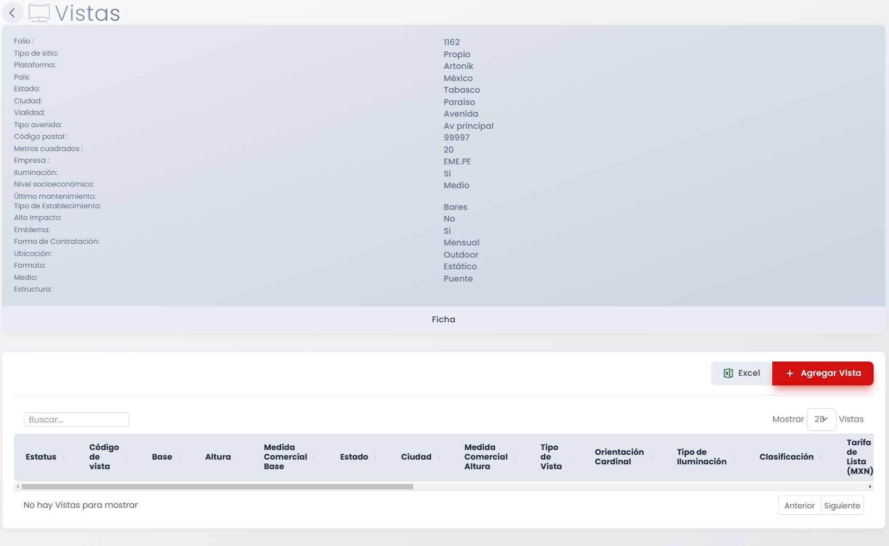
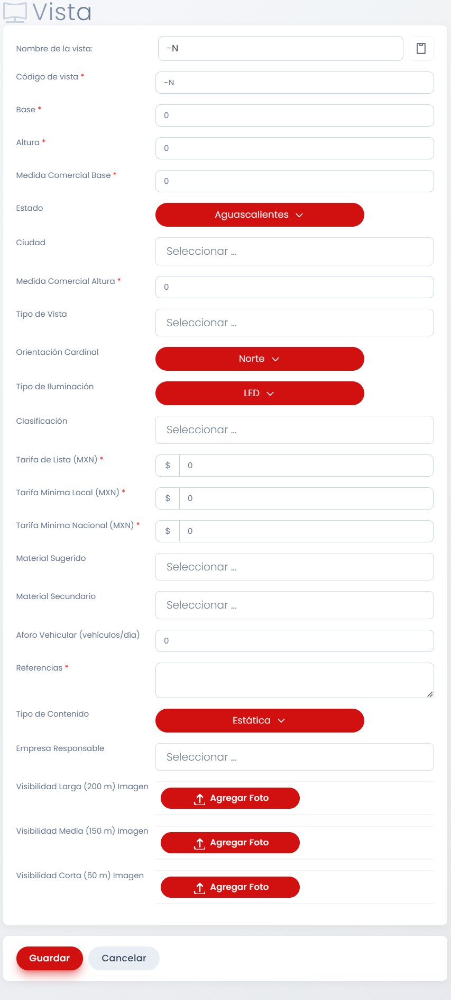
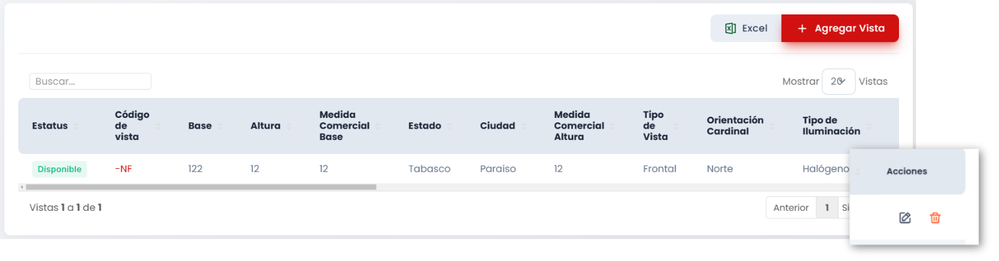

# Disponibilidad

## Introducción

Segundo deashboard de la categoría Oferta. Se muestra una tabla con todos los sitios cargados al sistema. La pantalla ofrece un mapa con los distintos sitios cargados al sistema, encima de este mapa hay filtros que podemos aplciarle. y debajo una tabla con los sitios según los filtros aplicados. 

!!! tip

    Con el cursor sobre la tabla,  `SHIFT + Rueda del Ratón` para navegar a través de ella.

## Acciones Importantes

A continiación se enumeran opciones de la sección de Sitios:

### 1. Filtros Generales
Existen 5 filtros disponibles a modificar al principio del dashboard, estos son:

- Tipo de Medio: Permite modificar es Estado de la Republica donde se cargan los sitios existentes.

- Ciudad: Según el estado seleccionado, mostrará sus ciudades.

- Ubicación: Las opciones disponibles son Todos, Indoor y Outdoor.

- Tipo de Medio: Las opciones disponibles son Antepecho, Bajo Puente, Centro Comercial, Columna, Digital, Espectacular, Landmark, Muro, Parabus y Puente.

- Solo Disponibles: Tenerlo activo hará que solo se muestren sitios disponibles.

En sitios disponibles hay una opción que dice Eliminar Parametros, usarla hara que se limpien los 5 filtros.

### 2. Mapa
A través de Google Maps es mostrado el mapa de la ubicación seleccionada, nos aparecerán en orbes azules y rojos los sitios existentes. El azul indica disponibilidad mientras que el rojo marca un sitio ocupado. 

Hacer click en uno de estos orbes nos acercará a la ubicación, donde después podremos seleccionar el sitio de nuestro interés. Al hacerlo aparecerá esta ventana:

Como podemos observar, nos da algunos detalles de la propiedad seleccionada y también nos permite marcarlo como favorito con el botón de corazón y también al hacer click en el botón de carrito se seleccionará la propiedad. Para más detalles sobre propiedades seleccionadas vaya a la acción número 9.

### 3. Agregar Sitio
Este botón desplegará un formulario que debe ser llenado para dar de alta un sitio. A continuación el tutorial para llevar este proceso a cabo.

---
#### Tutorial Agregar Sitios

Posterior al click en el botón de `Agregar Sitio`, se muestra el siguiente Formulario:

El llenado del formulario es bastante intuitivo, pero hay algunas cosas a considerar:

- Si no llenamos el campo `Folio Histórico` se le asignará un folio automaticamente al sitio.

- De no tener un campo llenado o tenerlo llenado pero icorrectamente, SIP comentará el error automáticamente antes de guardarlo para poder hacer correcciones.

- En caso de que queramos cancelar el alta del sitio, junto al boton de `Guardar` está el botón de `Cancelar`.

---

### 4. Mostrar Sitios
Hacer click en este botón nos desplegará opciones para mostrar en la tabla distintas cantidades de sitios por página, de esta forma podemos navegar de manera más cómoda entre sitios. Las opciones que nos dan son 5, 10, 20, 50 y 100 sitios a mostrar por página.

### 5. Botón Vistas
Hacer click en este botón abrirá la siguiente pantalla:

Aquí se encuentran los detalles del sitio con los que fue dado de alta el sitio, un botón que dice Ficha que nos lleva a la pantalla del  mismo nombre (Ver Número 6 para información de ese apartado), en la parte inferior tenemos una tabla donde aparecerán las vistas que hayamos agregado al sitio, aparecerá vacío si no se han agregado vistas, como es el caso de la imagen. Esta tabla de vistas también puede ser exportada como archivo `.xlsx`. Por último tenemos el botón de `Agregar Vistas`, a continuación el tutorial de este apartado.

---
#### Tutorial Agregar Vistas

Posterior al click en el botón de `Agregar Vista`, se muestra el siguiente Formulario:

Puntos a considerar:

- El campo Nombre de la Vista y Código de la Vista son asignados automáticamente según el llenado del formulario.

- Si asignamos el Tipo de Contenido como Digital en lugar de Estático, abajo aparecerá un segundo formulario que debe ser llenado en su totalidad para el alta:

- De no tener un campo llenado o tenerlo llenado pero icorrectamente, SIP comentará el error automáticamente antes de guardarlo para poder hacer correcciones.

- En caso de que queramos cancelar el alta de la vista, junto al boton de `Guardar` está el botón de `Cancelar`.

---

Una vez agregada la vista, se actualizará la tabla en la primera pantalla.

Dando click en el codigo de la Vista o en el botón de editar, podemos acceder nuevamente al formulario y hacer modificaciones. El botón de eliminar también está presente.

### 6. Botón Ficha
Siempre que haya al menos una vista cargada en el sitio, al dar click aquí aparecerá su ficha:

### 7. Editar y Eliminar
El botón editar desplegará el formulario nuevamente para su modificación y el botón de eliminar dará de baja el sitio.

### 8. Navegación
Controladores para moverse entre páginas.