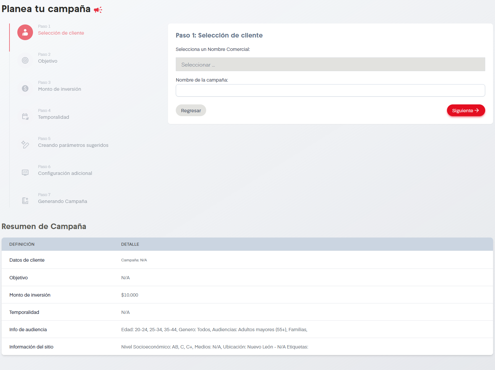
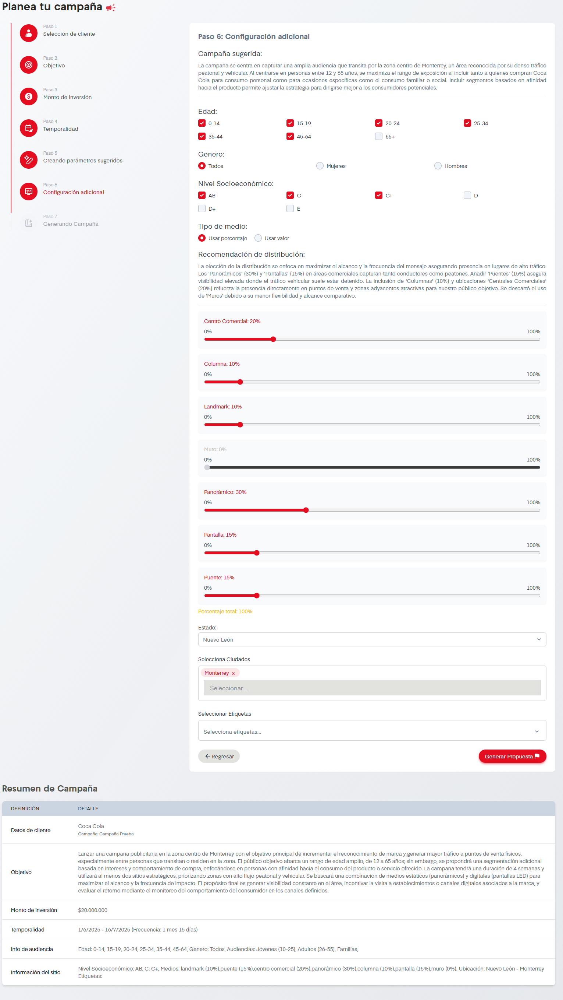
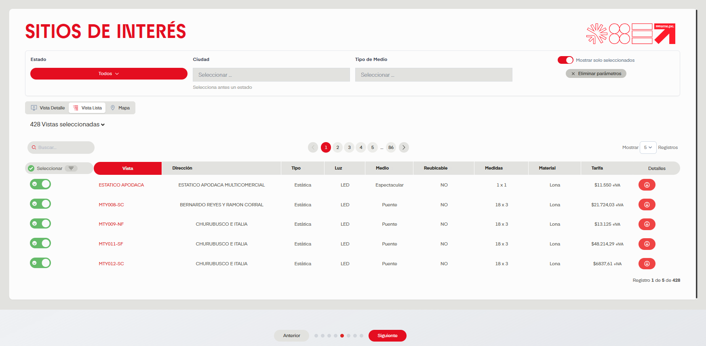

# Planea

En esta sección del apartado Oferta se nos permite, como el nombre indica, planear una campaña. A continuación describiremos cada paso del proceso.

## Paso a Paso

A continiación se enumeran opciones de la sección de Sitios:

### Paso 1: Selección de Cliente

Debemos seleccionar un Nombre Comercial, en función del Nombre Comercial nos pueden solicitar una Agencia y finalmente establecer el nombre de la campaña, una vez llenados estos tres datos podemos continuar a la siguiente etapa.

### Paso 2: Objetivo de la campaña

Se muestra un cuadro de texto donde se nos solicita descibir el objetivo de la campaña. Al dar click en siguiente, la Inteligencia Artificial (IA) nos apoyará a generar especificaciones para la campaña. Por esto es importante que en el objetivo se establezca:

- Ubicación geográfica donde se llevará a cabo la campaña.

- Público objetivo.

- Métricas de éxito deseadas.

- Cualquier restricción o requisito específico que pueda tener la campaña.

Si llegase a faltar algún dato se desplegará un mensaje para que el usuario sepa que información falta por cubrir. En caso de que todo este completo SIP avanzará al usuario al siguiente paso.

### Paso 3: Monto de Inversión
Se presentará un cuadro de texto donde se debe especificar el monto de inversión de la campaña. También aparecerá una barra desplazable que permite ajustar la inversión sin necesidad de escribirla. Cuando el usuario este seguro del monto seleccionado se puede continuar al cuarto paso.

### Paso 4: Temporalidad

En este paso se debe seleccionar el rango de fechas que comprenderá la campaña. La fecha de la izquierda siendo el inicio de la campaña y la derecha el final.

### Paso 5: Generando Parámetros Sugeridos

Por medio de la IA de OpenAI se generará una campaña Sugerida, Primeramente nos aparecerá una pantalla de carga con el logo de OpenAI la cual estará generando nuestra campaña por alrededor de 20 segundos. En cuanto termine de generarlo la pantalla desplegará datos sugeridos para nuestra campaña, que corresponden al sexto paso de Planea tu Campaña.

### Paso 6: Configuración Adicional

Así se debería ver la información generada por IA para nuestra campaña

Es importante aclarar que todos estos datos son sugeridos, y por tanto, editables. Si deseamos hacer alguna corrección o adición a alguna parte de la campaña sugerida podemos hacerlo. También es importante añadir etiquetas al final del formulario. Una vez que deseemos continuar podemos presionar el botón de Generar Propuesta.

### Paso 7: Generando Campaña

Nuevamente por medio de IA se generará una propuesta de marketing dispuesta en diapositivas. Serán descritos los servicios que eme.pe. ofrece, los clientes a los que trabaja eme.pe., el presupuesto y la temporalidad establecida y siguiente a esto habrá vistas de interés que la IA selecciona automáticamente, podemos quitar de la lista si damos click en el switch verde, ver los detalles de cada vista si presionamos la flecha roja que tiene cada una a su derecha. También podemos filtrar por nombre, ubicación, tipo de medio e incluso buscar fuera de los que han sido seleccionados por IA si así se desea.

