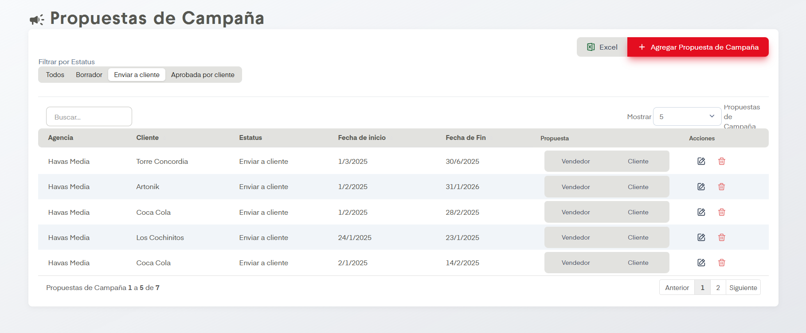
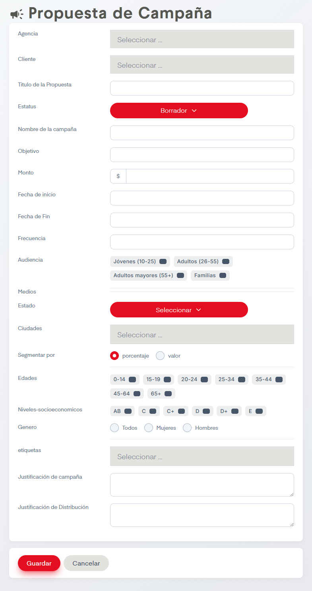

# Propuestas

??? info "Sobre la enumeración de acciones"

    Esta página no tiene mucho contenido así que se omitirá la enumarción de acciones.

Aquí se pueden consultar, agregar, ediar o dar de baja Propuestas de Campaña, aparecerán aquí las propuestas aceptadas de la sección anterior "Planea tu Campaña" pero también es posible agregar propuestas usando el botón de "Agregar Propuesta de Campaña"

## Acciones Importantes

Contamos con controladores comunes como la opción de exportar a excel, cuadro de busqueda y navegación entre páginas de tablas, así como acciones de editar (representada con un lápiz) y eliminar (representada con un bote de basura).

Empecemos por la opción de Filtrar por Estatus, está opción nos dejará rotar entre tablas de propuestas en función de su estatus (Borrador, Enviar a Cliente, Aprobada por Cliente) o si así se desea se pueden desplegar todas las propuestas en existencia.

Posteriormente, en cada Propuesta aparecerán dos botones donde se puede ver la propuesta generada y la enviada al cliente, esto en caso de que se desee consultar y/o editar.

Por último se cuenta con el botón de agregar propuesta el cual da el siguiente formulario.

Como podemos ver es muy parecido al de la sección anterior, sin embargo en este no seremos apoyados por inteligencia artificial para generar los datos así que se debe tener la idea precisa de lo que se busca con la campaña.

