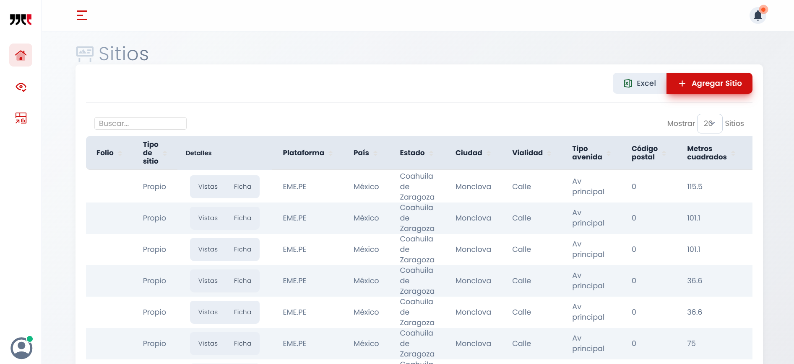
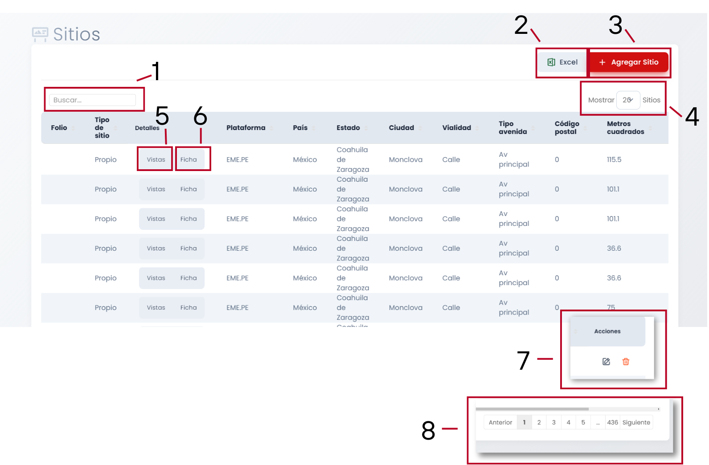
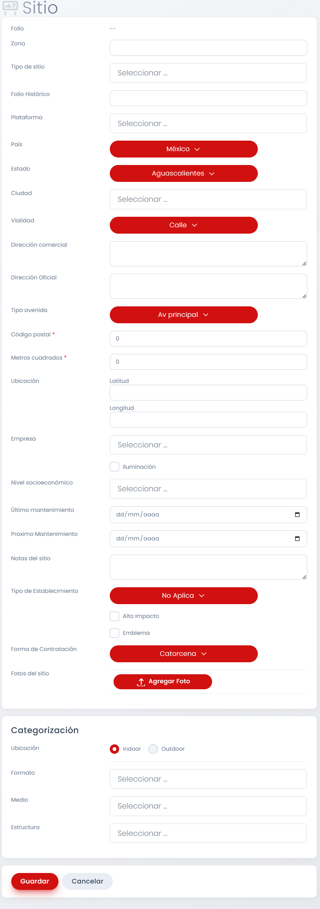
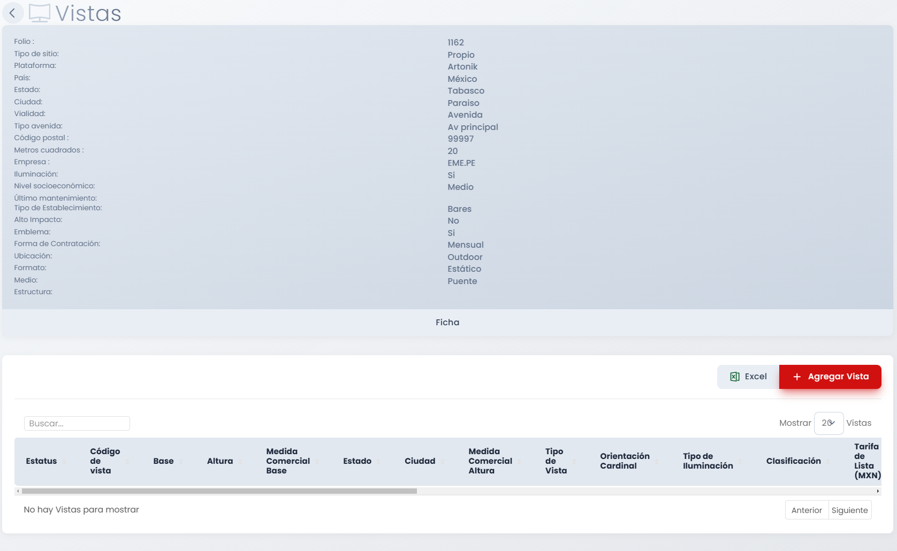
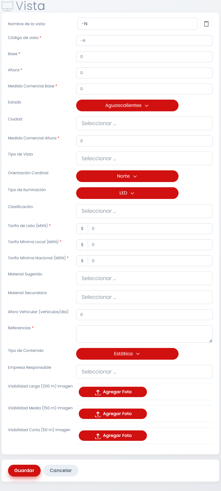
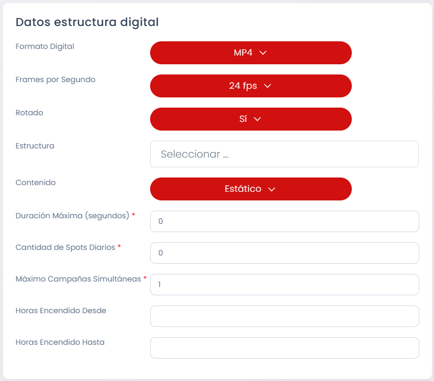
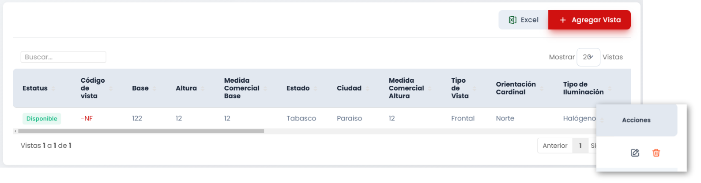
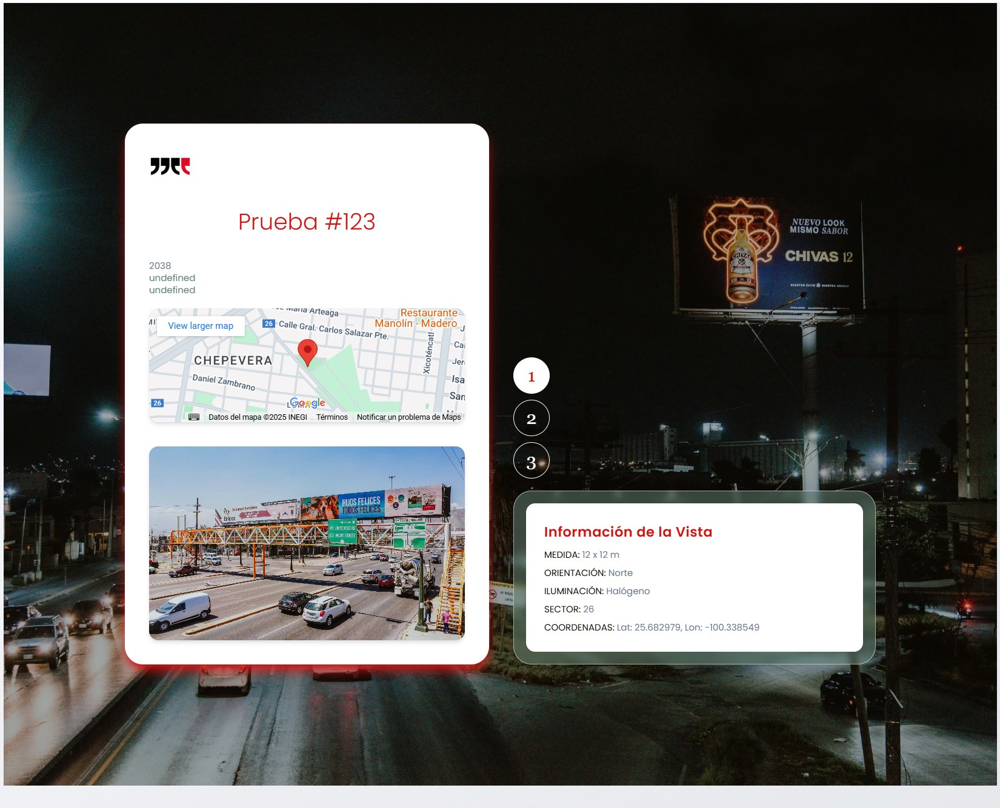

# Sitios

## Introducción

En esta primera sección de la categoría de Oferta se despliega una tabla con todos los sitios cargados al sistema, estos datos lleva la tabla: Folio, Tipo de Sitio, Detalles (botones que dan acceso a Vistas y Ficha), Plataforma, País, Estado, Ciudad, Vialidad, Tipo avenida, Código Postal, Metros Cuadrados, Empresa, Iluminación, Nivel Socioeconómico, Último Mantenimiento, Tipo de Establecimiento, Alto Impacto, Emblema, Forma de Contratación, Ubicación, Formato, Medio, Estructura y Acciones (botones para Editar y Eliminar Sitios Existentes)

!!! tip

    Con el cursor sobre la tabla,  `SHIFT + Rueda del Ratón` para navegar a través de ella.

## Acciones Importantes

A continiación se enumeran opciones de la sección de Disponibilidad:

### 1. Cuadro de Búsqueda
En este cuadro podemos buscar sitios por medio de palabras clave o números, como en cualquier cuadro de búsqueda común.

### 2. Exportar a .xlsx
Este botón nos permite exportar la totalidad de los sitios en la tabla con todos sus datos a un archivo `.xlsx` que podremos abrir via Excel o Google Sheets.

### 3. Agregar Sitio
Este botón desplegará un formulario que debe ser llenado para dar de alta un sitio. A continuación el tutorial para llevar este proceso a cabo.

---
#### Tutorial Agregar Sitios

Posterior al click en el botón de `Agregar Sitio`, se muestra el siguiente Formulario:

El llenado del formulario es bastante intuitivo, pero hay algunas cosas a considerar:

- Si no llenamos el campo `Folio Histórico` se le asignará un folio automaticamente al sitio.

- De no tener un campo llenado o tenerlo llenado pero icorrectamente, SIP comentará el error automáticamente antes de guardarlo para poder hacer correcciones.

- En caso de que queramos cancelar el alta del sitio, junto al boton de `Guardar` está el botón de `Cancelar`.

---

### 4. Mostrar Sitios
Hacer click en este botón nos desplegará opciones para mostrar en la tabla distintas cantidades de sitios por página, de esta forma podemos navegar de manera más cómoda entre sitios. Las opciones que nos dan son 5, 10, 20, 50 y 100 sitios a mostrar por página.

### 5. Botón Vistas
Hacer click en este botón abrirá la siguiente pantalla:

Aquí se encuentran los detalles del sitio con los que fue dado de alta el sitio, un botón que dice Ficha que nos lleva a la pantalla del  mismo nombre (Ver Número 6 para información de ese apartado), en la parte inferior tenemos una tabla donde aparecerán las vistas que hayamos agregado al sitio, aparecerá vacío si no se han agregado vistas, como es el caso de la imagen. Esta tabla de vistas también puede ser exportada como archivo `.xlsx`. Por último tenemos el botón de `Agregar Vistas`, a continuación el tutorial de este apartado.

---
#### Tutorial Agregar Vistas

Posterior al click en el botón de `Agregar Vista`, se muestra el siguiente Formulario:

Puntos a considerar:

- El campo Nombre de la Vista y Código de la Vista son asignados automáticamente según el llenado del formulario.

- Si asignamos el Tipo de Contenido como Digital en lugar de Estático, abajo aparecerá un segundo formulario que debe ser llenado en su totalidad para el alta:

- De no tener un campo llenado o tenerlo llenado pero icorrectamente, SIP comentará el error automáticamente antes de guardarlo para poder hacer correcciones.

- En caso de que queramos cancelar el alta de la vista, junto al boton de `Guardar` está el botón de `Cancelar`.

---

Una vez agregada la vista, se actualizará la tabla en la primera pantalla.

Dando click en el codigo de la Vista o en el botón de editar, podemos acceder nuevamente al formulario y hacer modificaciones. El botón de eliminar también está presente.

### 6. Botón Ficha
Siempre que haya al menos una vista cargada en el sitio, al dar click aquí aparecerá su ficha:

### 7. Editar y Eliminar
El botón editar desplegará el formulario nuevamente para su modificación y el botón de eliminar dará de baja el sitio.

### 8. Navegación
Controladores para moverse entre páginas.