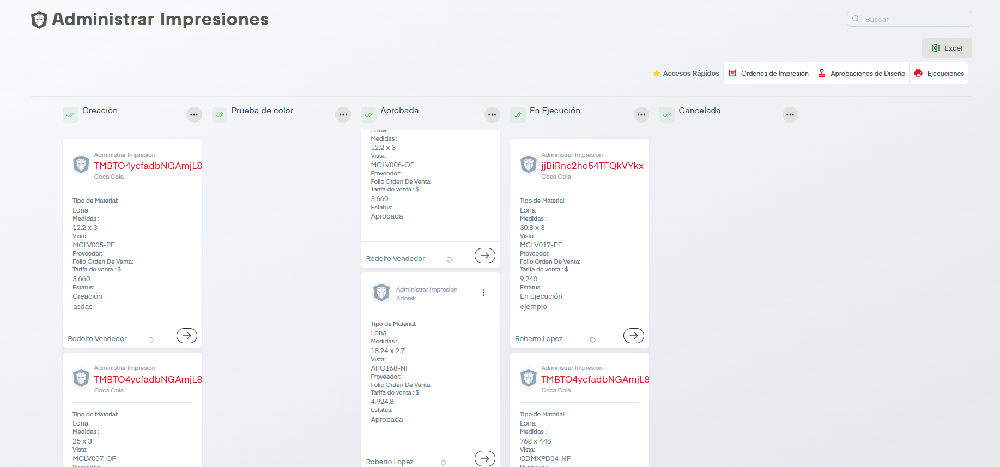

# Administrar Impresiones

A través de esta pantalla podemos gestionar las distintas fases de una orden de impresión, desde su creación hasta su ejecución o cancelación. 

En esta sección podemos llevar varias acciones a cabo para llevar a la correcta ejecución de la impresión. 

## Etapas

A continuación explicaremos que hacer según la etapa de la orden de impresión.

### Creación

Cuando ya fue generada la orden de impresión va a aparecer aquí en una tarjeta. En la parte inferior de la tarjeta aparece el autor y también un botón con el icono de una flecha. Al dar click en ese botón aparecerá una pequeña tabla con la fecha de la creación de la orden, y su etapa, abajo aparece un botón que dice Mandar a Aprobar. Si se da click en este botón tenemos que escribir quien es el aprobador ya que este dato es obligatorio, pero también podemos agregar foto del diseño y observaciones. Cuando se este listo hay que dar click en guardar.

Nos daremos cuenta de que la tarjeta ya no está en la sección de Creación, ahora pasó a Aprobada.

### Prueba de Color

### Aprobada

Se muestran la tarjetas de las ordenes que recién fueron aprobadas. La tarjeta tiene el mismo botón con la flecha. Al dar click muestra la tabla con el registro de la creación y el diseño aprobado.

Tenemos la opción de ir a la aprobación (podemos ir si queremos corroborar algún dato u obtener QR de la impresión) o de programar la impresión. Si decidimos programar la impresión se mostrará el siguiente formulario.

Es importante seleccionar un proveedor, seleccionar las vistas y llenar todos los datos solicitados.

### En Ejecución

En esta etapa tenemos dos opciones al dar click en el botón de la flecha; ir a la aprobación nuevamente si quisieramos conocer datos sobre el diseño o si queremos generar su QR o bien mandar a ejecución la impresión.

### Cancelada

