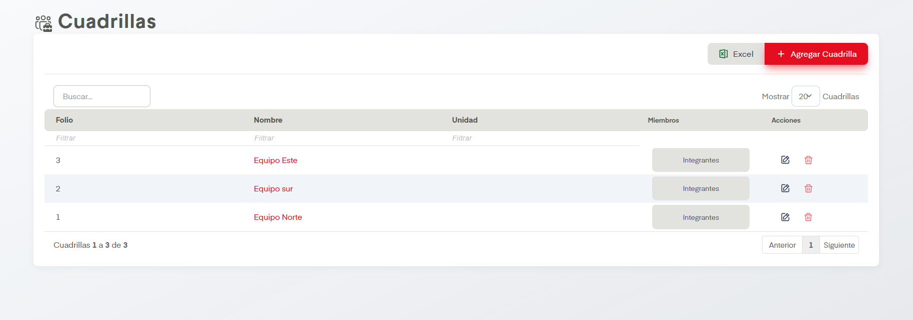
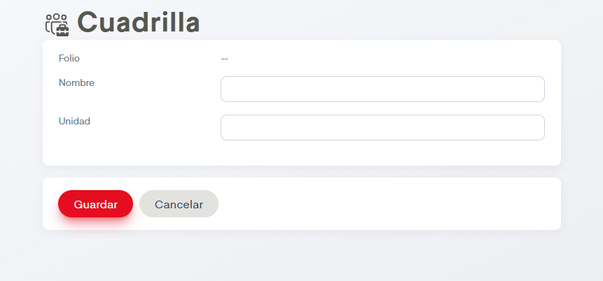
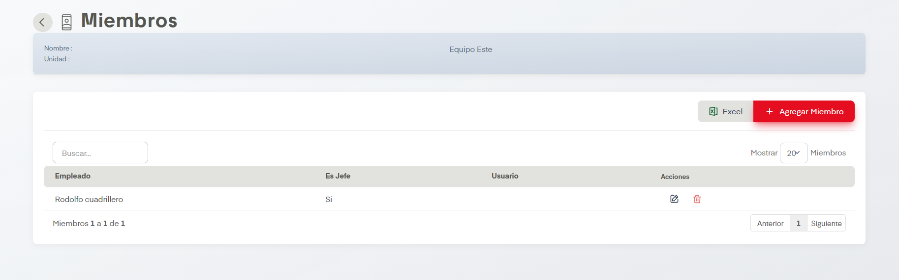

# Cuadrillas

??? info "Sobre la enumeración de acciones"

    Esta página no tiene mucho contenido así que se omitirá la enumarción de acciones.

En el apartado de Cuadrillas se nos permite dar de alta, editar y eliminar cuadrillas en SIP.

## Acciones Importantes

Como en otras pantallas, se cuenta con botón de exportación a archivo compatible con Excel y un controlador para ver las páginas de registros en caso de que haya más de una página. También contamos con un cuadro de busqueda. Si se desean hacer ediciones podemos dar click en el nombre de las cuadrillas o en el ícono del lápiz, ambos llevan a la misma pantalla de edición. Es posible  también eliminar cuadrillas si damos click en el ícono del bote de basura.

La acción principal en esta pantalla es Agregar Cuadrilla. Este botón dirige a la siguiente pantalla.

Se deben llenar los datos para dar de alta el empleado. Los datos que aparecen con asterisco a la izquierda son campos obligatorios. Cuando deseemos editar algún empleado se dirigirá al usuario a esta misma pantalla.

Como podemos ver en la primera imagen hay un botón más que dice Integrantes. Al dar click lleva a este formulario.

En esta sección nos aparecen los empleados pertenecientes a la cuadrilla y su rol (si es o no jefe), usuario asociado y también controladores de páginas y los mismos botones de acciones para editar y eliminar e incluso un botón para exportar a los miembros de la cuadrilla a un documento compatible con excel. Tenemos también el botón de Agregar Miembro que muestra un formulario donde se solicita Empleado, una casilla de verificación para marcar si es jefe o no y por último usuario, posteriormente es posible guardar el usuario.