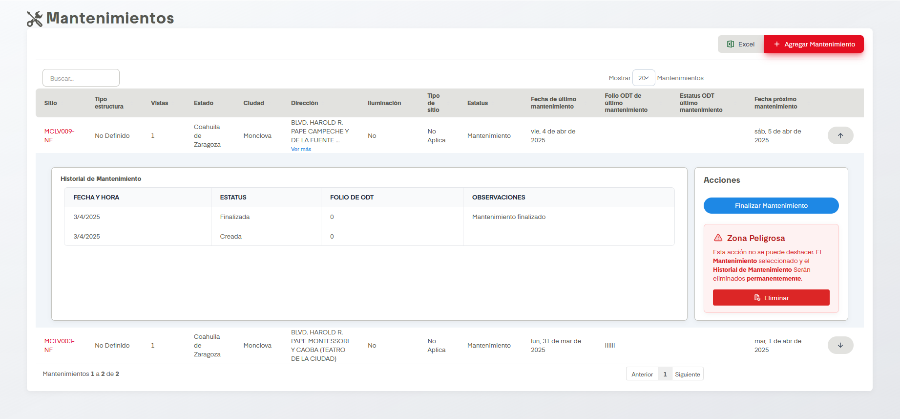
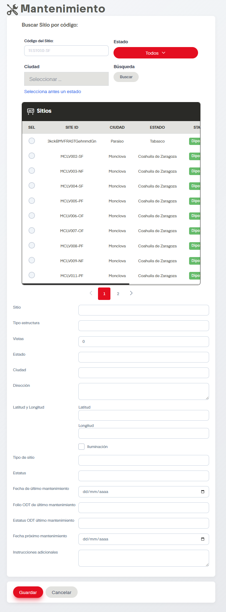

# Mantenimiento

??? info "Sobre la enumeración de acciones"

    Esta página no tiene mucho contenido así que se omitirá la enumarción de acciones.

!!! warning "Eliminar Mantenimientos"

    Eliminar mantenimientos es una acción  que no se puede deshacer. El Mantenimiento seleccionado y el Historial de Mantenimiento serán eliminados permanentemente.

En el apartado de Mantenimientos se nos permite dar de alta, finalizar y eliminar mantenimientos en SIP.

## Acciones Importantes

Como en otras pantallas, se cuenta con botón de exportación a archivo compatible con Excel y un controlador para ver las páginas de registros en caso de que haya más de una página. También contamos con un cuadro de busqueda. Es posible  también eliminar el mantenimiento si damos click en el botón rojo que lleva por nombre Eliminar, solo tengamos en cuenta la advertencia que nos da la misma pantalla.

También tenemos el botón de Finalizar mantenimiento, solo se debe dar click en esta acción cuando el mantenimiento haya finalizado definitivamente, hacer esto no eliminará de la vista el mantenimiento sino que solo dejará el registro de su finalización.

La acción principal en esta pantalla es Agregar Mantenimiento. Este botón dirige al siguiente formulario.

Se deben llenar los datos para dar de alta el mantenimiento. Cuando seleccionemos el Sitio ya sea a través de codigo o seleccionándolo en la tabla, se llenarán autómaticamente varias secciones del formulario por tanto es importante identificar primeramente el sitio antes de llenar el resto de apartados. Podemos apoyarnos en los filtros de más arriba en en formulario como es estado y ciudad para hacer más sencilla la busqueda.

Al finalizar hay que dar click en guardar.