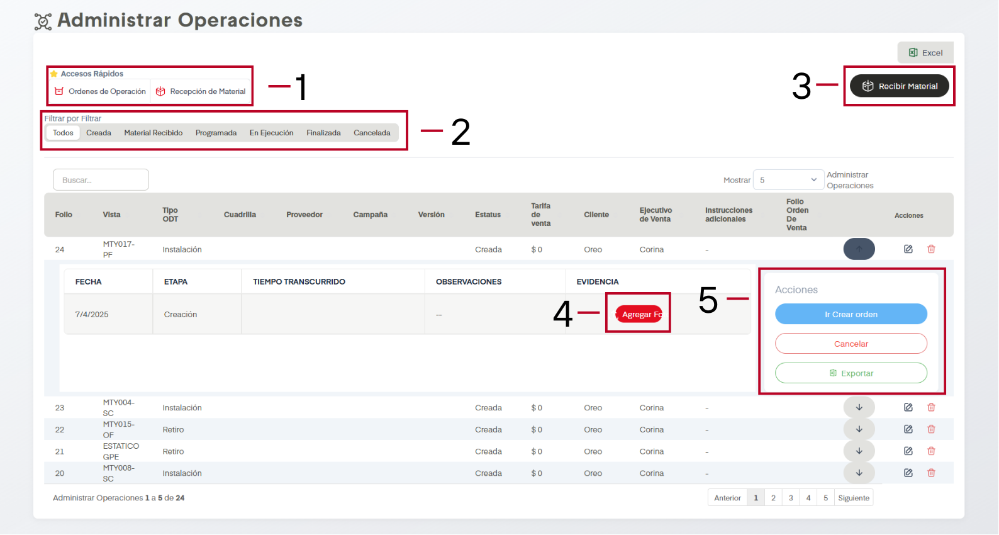
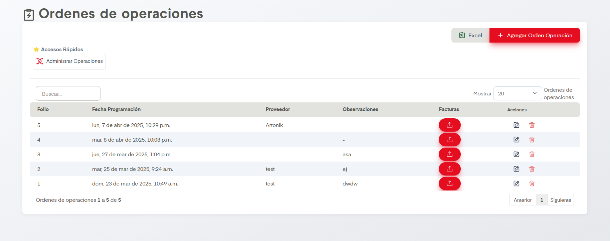
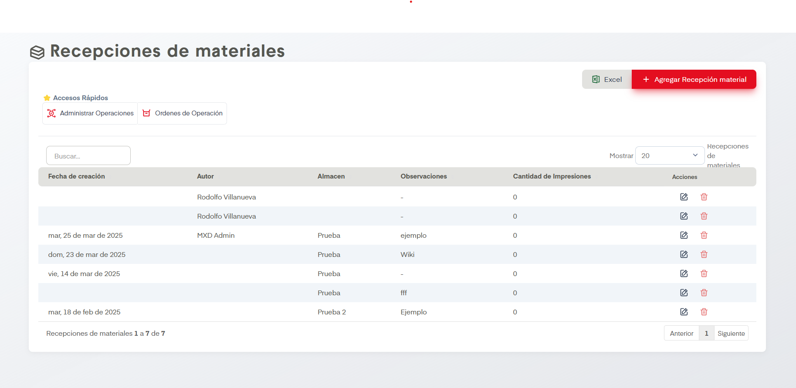

# Recibir Material

??? info "Botones comunes"
    Se omite explicación de funciones en la mayoría de tablas como lo son editar, eliminar, exportar a excel.

En el apartado de Recibir Material podemos administrar operaciones en SIP.

## Acciones Importantes

### 1. Accesos Rápidos

#### Órdenes de Operación

Nos lleva a la siguiente pantalla

#### Recepción de Material

Nos lleva a la siguiente pantalla

Si dimos click antes en el botón de <a href="#3-recibir-material">Recibir Material</a> y guardamos el producto recibido, aquí va a aparecer.

### 2. Tablas por Filtros

Fácilita la busqueda o filtro de elementos de la tabla según las necesidades del usuario, ya sea para buscar operaciones o para exportar datos.

### 3. Recibir Material

Dar click aquí abrirá un formulario donde se debe seleccionar las ordenes recibidas, al finalizar agrega la recepción a la tabla en <a href="#recepcion-de-material">Recepción de Material</a>

### 4. Agregar Foto

Es importante agregar evidencia para cada etapa de la operación, desde este botón podremos agregarla.

### 5. Acciones

Se ofrecen tres posibles acciones para cada orden.

#### Ejecutar

Aparece ventana donde solicita especificar Tipo ODT y vistas a corta distancia, a detalle y a larga distancia antes de confirmar la ejecución.

#### Cancelar

Si decidimos cancelar la operación nos aparecerá una pantalla donde debemos adjuntar evidencia y escribir una razón antes de cancelar.

#### Exportar 

Exporta la operación seleccionada a un tipo de documento compatible con excel.