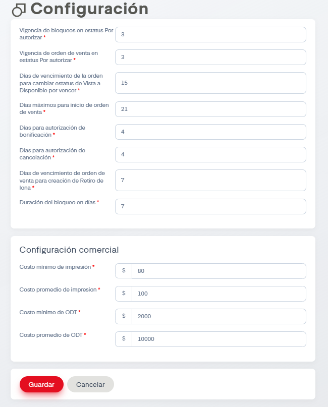

# Configuración

En este apartado es posible ajustar varios periodos en SIP, dígase vigencias, días para vencimiento de ordenes, días para autorización, etcétera. También es posible establecer la configuración comercial, donde se establecen costos mínimos y promedios para impresión y ODT.

A continuación se muestra la pantalla:

Solo contaremos con el botón de Guardar si estamos de acuerdo con los cambios realizados o de cancelar si queremos regresar a los datos anteriormente establecidos y salir de la sección.

