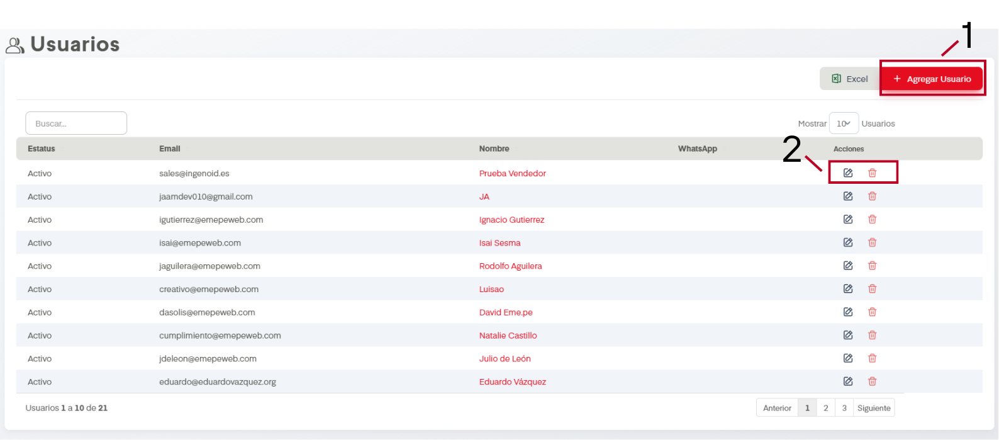
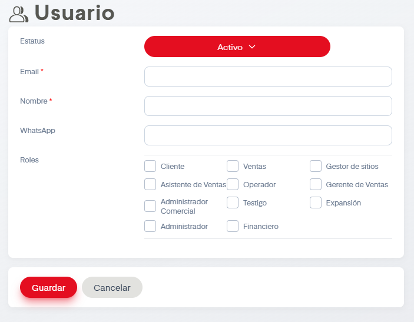

# Usuarios

Si tenemos los permisos adecuadeos seremos capaces de gestionar empleados, es decir, darlos de alta, de baja o editarlos.

Se despliega esta pantalla para la sección.

Al igual que en varias tablas de SIP, contamos con una barra de busqueda y un botón de exportación a excel.

## Acciones Importantes

A continiación se muestran las acciones primordiales de la sección Usuarios.

### 1. Agregar Usuarios

Seleccionar esta opción mostrará esta pantalla

En estatus podemos establecer si el usuario se encontrará activo o inactivo, controlando así su acceso a SIP. Posteriormente será necesario agregar tanto email como nombre para poder dar acceso a SIP. 

En WhatsApp podemos agregar número de telefono y justo debajo podemos establecer el rol o roles del usuario a agregar.

### 2. Acciones (Editar y Eliminar)

Al dar click en el nombre de usuario o en la acción de editar se desplegará la misma pantalla que al crear usuario, solamente que estarán prellenados los datos. Si se decide cambiarlos hay que dar click en guardar al finalizar los cambios.s

